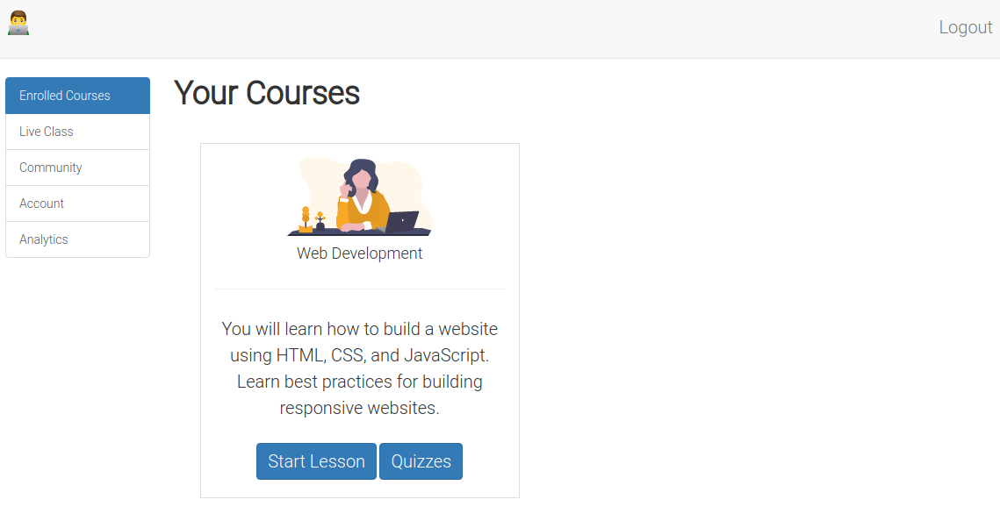

       

# Somasoma eLearning Application

This is a sample eLearning application used to demonstrate how interactive virtual classes can take place. The application users are teacher, student and  parent. There is also an admin user who has some super powers in the application.



The application is built into two broad categories:
 - Website
   - [x] General information about course offerings
   - [x] Payment for course offerings
   - [x] Registration of students and their parents
   - [x] Public events
   - [x] Blog articles
   - [ ] Anonymous user can leave comments on blog articles
   <br>
 - eLearning Application
    - [x] Only accessible upon payment and full parent and student registration
    - [x] Login details sent to parents and students via email
    - [x] Students can learn their courses here
    - [ ] Parents can view student progress
    - [x] Teachers can create courses and manage students
## Users

These are the custom roles and responsibilites of the users in the application:

### Admin

* Maintains the application
  - [x]  Registers teachers
  - [x] The only one who can delete teacher, parent and student accounts
  - [x] Can see all the registration details of teachers, parents and students
* Manages the content used by anonymous users of the application
  - [x] Update course offerings
  - [x] Comments moderation
  - [x] Student stories 

Comimg soon...
- Can see the usage statistics of the application by:
  - [ ] Teachers
  - [ ] Parents
  - [ ] Students

### Teacher

* General abilities:
  - [x] Can explore the application to find and follow other teachers
  - [x] Can see list of all students enrolled for the course they will be teaching
  - Can view individual student's profile:
    - [x] Personal registration details
    - [x] Student's individual comments in the eLearning community
    - [ ] Student's learning analytics
  - [x] Can only view what all students say in the eLearning community
<br>

* Manages individual lessons:
  - [x] Provides overview of course content
  - [x] Create lesson chapters for a course they registered for
  - [x] Can update course table of contents on the go
  - [x] Creates lesson objectives
  - [x] Creates learning objectives per chapter for each student
  - [x] Creates quizzes for each chapter
  - [x] Creates overall quiz for the course
<br>

* Student management:
  - [ ] Moderation of student's comments in each course chapter
  - [ ] Assesses student's achievements in each course chapter (automatic by the application)
  - [ ] Assesses student's achievements in the overall course (automatic by the application)
<br>

* Event Management
  - [ ] Teacher can create (and delete) events for students and the general public to attend
<br>

* Blog Management
  - [ ] Teacher can only create blogs seen in the blogs page
  - [ ] Teacher can allow the blog created to be posted in the public section of the application
  * Only the admin can delete these blogs

### Student

* Course (resitricted to the course they registered for)
  - [x] Can enrol for only one course at a time
  - [ ] Can do the overall quiz for the enrolled course
  - [x] Can post comments in each course chapter
<br>

* General
  - [x] Can explore all other students in the application
  - [x] Can follow or unfollow other students
  - Can view individual student's profile:
    - [x] Personal registration details
    - [x] Student's individual comments in the eLearning community
<br>

* Learning Analytics
  - Can view their own learning analytics:
    - [ ] Each chapter's learning objectives
    - [ ] Each chapter's quiz results
    - [ ] Overall course quiz results
  - Can see how other students have achieved:
    - [ ] Each chaper objectives
    - [ ] Each chapter quizzes
    - [ ] Overall course quiz

### Parent

Coming soon...

## Features

- Student registration and authentication
- Parent registration and authentication
- Teacher authentication and authorization
- Admin authentication and authorization
<br>

- Two-factor authentication
- Email notifications
- Credit card payment
- Scheduling for virtual classes
- Comment moderation
- Localhost testing on another device
- Basic email validation
- Beautiful phone number fields

Comming soon:
- Video conferencing facility
- Live language translation
- Data visualization of student performance
- Markdown editing in forms
- Google reCaptcha on forms for extra security aganist spam
- Interactive tables (sorting, searching and pagination)

## Tools Used

- Python for programming
- Flask for web development
- SQLAlchemy for database management
- Bootstrap for styling and cross-browser responsiveness
- Flask moment for date and time formatting
- Flask-WTF for form management
- Flask-Mail for email notifications
- Flask-Login for user authentication
- Stripe API for credit card payment (test mode)
- Twilio Verify API for two-factor authentication
- Ngrok for localhost testing
- Email validator for email addresses
- Phonenumber package for phone number formatting


## License

- MIT License

## Application Design

This application is currently on its **second** iteration. Over the months, I have reconsidered the design of the application and have added some new features.

- [Version 1 Design](https://www.figma.com/proto/uG0hCD0uuAYbWZIhjf6fPz/somasoma-eLearning-app?node-id=179%3A2&scaling=min-zoom&page-id=0%3A1) 

- [Version 2 Design](https://www.figma.com/proto/AzhdESXorALZD9F0rPUeEs/somasoma_version3_student?node-id=5%3A17&scaling=min-zoom&page-id=0%3A1&starting-point-node-id=5%3A17&show-proto-sidebar=1)

Kindly note that the current application may be miles ahead of the design seen in the latest version. During development, I may have added or discarded some things as the idea of the final application grows.


## Contributors

[](https://github.com/GitauHarrison/somasoma-eLearning-app/graphs/contributors)

## Deployment

- [Somasoma eLearning App on Heroku]() (coming soon)
- [Somasoma eLearning App on Docker]() (coming soon)

## Testing the Application Locally

* Clone this repo:
```
$ git clone git@github.com:GitauHarrison/somasoma-eLearning-app.git
```

* Move into the cloned directory:

```
$ cd somasoma-eLearning-app
```

* Create and activate your virtual environment:

```
$ mkvirtualenv somasoma-elearning # I am using virtualenvwrapper
```

* Install project dependencies within your active virtual environment:

```
(somasoma-elearning)$ pip3 install -r requirements.txt
```

* Start the flask server:

```
(somasoma-elearning)$ flask run
```

* Access the application on http://127.0.0.1:5000/

## Using the Application

* [See video]() (as soon as project is complete)

<hr>

[](https://github.com/GitauHarrison/)